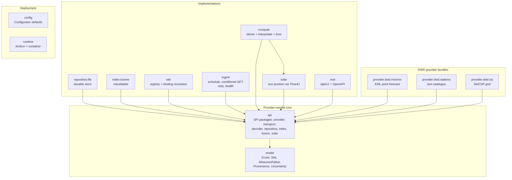
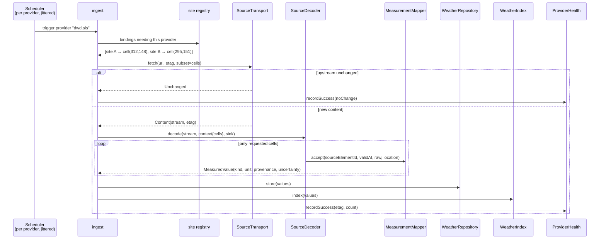

# Target Architecture

Derived from [01-vision.md](01-vision.md) and [03-requirements.md](03-requirements.md), addressing the
findings in [04-architecture-current.md](04-architecture-current.md). Individual decisions and their
alternatives live in the [ADRs](adr/index.md); this document describes the resulting shape.

## Guiding shape

Three rules that most of the structure follows from:

1. **The site is the subject, the station is a source.** Everything the service stores is anchored to
   a site or to a source location that a site binds to — never to "the station as the answer".
   → `F-17`, [ADR-0009](adr/0009-site-as-central-entity.md)
2. **The repository is the truth; everything else is derived.** The index is rebuildable, the fused
   timeline is computed, the provenance is stored. One direction of dependency, no cycles.
   → `F-8`, [ADR-0004](adr/0004-persistence-index-split.md)
3. **A value is never bare.** Every stored or returned value carries its origin and its quality. This
   is a model invariant, not a convention. → `F-20`,
   [ADR-0011](adr/0011-lineage-and-uncertainty.md)

## Bundle layout

Fourteen bundles plus tests. Deliberately fewer than the concern count: the provider-neutral SPI is
**one bundle with several independently versioned exported packages**, which is the OSGi-idiomatic way
to separate contracts without paying per-bundle overhead — a real consideration at one developer.



Note what is **absent**: no provider bundle depends on another, no implementation depends on another
implementation, and nothing in the core depends on anything DWD. That is the structural expression of
`DEV-1` and the falsifiable half of the vision.

| Bundle | Responsibility | Replaces |
| --- | --- | --- |
| `…weather.model` | Ecore-generated canonical model | old `model` (rewritten content) |
| `…weather.api` | All provider-neutral SPI packages | old `api` (DWD content removed) |
| `…weather.repository.file` | Durable store: XMI per site, plus the append-only raw record | `SimpleWeatherReportStorage` |
| `…weather.index.lucene` | Search index, rebuildable from repository — **not in the MVP** | `WeatherReportIndexService` (inverted) |
| `…weather.site` | Site registry, source-binding resolution, backfill | *new* |
| `…weather.ingest` | Scheduling, change detection, retry, per-provider isolation, health | logic inside each fetcher |
| `…weather.compute` | Derived quantities, interpolation, fusion, supersession | *new* |
| `…weather.solar` | Sun position and day events via Time4J | `org.gecko.time4j` (extended) |
| `…weather.rest` | Versioned HTTP API and OpenAPI — **deferred**, see [ADR-0008](adr/0008-rest-api-design.md) | old `rest` |
| `…weather.provider.dwd.icon` | **ICON-D2 gridded cloud and radiation provider (GRIB2)** — the primary source | *new* |
| `…weather.provider.dwd.mosmix` | MOSMIX point forecast provider | `dwd.forecast` (decode only) |
| `…weather.provider.dwd.stations` | Station catalogue provider | `dwd.stations` (fetch only) |
| `…weather.provider.dwd.sis` | SIS gridded global radiation provider (NetCDF) | `netcdf` spike, productionised |
| `…weather.provider.dwd.uv` | UV index provider (GRIB2, health forecasts) | *new* |
| `…weather.config` | Configurator default configuration | old `dwd.config` |
| `…weather.runtime` | Launch configuration and container | old `runtime` + `docker` |

**Coordinates are settled** ([ADR-0001](adr/0001-greenfield-new-repository.md)): the rebuild is a branch
named **`sunorcloud`** of `geckoprojects-org/org.gecko.weather`, Maven group `org.geckoprojects.weather`
unchanged. The bundle prefix is therefore `org.gecko.weather.*`; the `…` above is kept only to keep the
table narrow.

**The runtime stack is Eclipse Fennec, not Gecko** ([ADR-0002](adr/0002-emf-as-core-model.md)):
`org.eclipse.fennec.emf.osgi` for EMF in OSGi, Fennec Codec for serialisation, Fennec Persistence
(`eclipselink`/`mongo`) as the prepared backend behind `repository.file`, Fennec M2X for OCL. The DWD and
KML Ecore models come from `fennec.common.models`. External decoding libraries stay Gecko wraps —
`org.gecko.ucar.netcdf` and `org.gecko.ucar.units` from
[org.gecko.libraries](https://github.com/geckoprojects-org/org.gecko.libraries), which need extending
with the GRIB module for ICON-D2.

**What the MVP contains** is narrower than this table: see [08-mvp.md](08-mvp.md). `index.lucene`, `rest`
and most of `ingest`'s operational qualities are out of scope for it.

## The canonical model

The central change: replace `MOSMIXSWeatherReport`'s fixed set of unqualified floats with values that
carry their own identity, origin and quality.

```
MeasuredValue
  kind          : MeasurementKind    // canonical: AIR_TEMPERATURE, GLOBAL_RADIATION, CLOUD_COVER_LOW …
  validAt       : Instant            // the instant the value describes
  value         : double
  unit          : Unit               // canonical unit for the kind
  provenance    : Provenance
  uncertainty   : Uncertainty

Provenance
  providerId    : String             // "dwd.mosmix", "dwd.sis"
  productId     : String             // "MOSMIX_L", "SISfc"
  modelRun      : Instant?           // which run produced it
  issueTime     : Instant?           // when the source published it
  origin        : Origin             // STATION | GRID_CELL | COMPUTED | ADHOC
  stationId     : String?
  gridRef       : GridRef?           // cell indices, cell size, cell origin
  distance      : double?            // metres from the site to station or cell centre
  derivation    : Derivation?        // function id + references to input values

Uncertainty
  quality       : Quality            // MEASURED | FORECAST | INTERPOLATED | FUSED | DEGRADED
  spatialMetres : double?            // how far the value was carried
  temporal      : Duration?          // how far it was interpolated in time
  sourceSpread  : double?            // disagreement among fused contributors
  note          : String?

Site
  id                : String
  name              : String
  location          : GeoPosition    // lat, lon, elevation
  attributes        : Map<String,String>   // extensible; tilt/azimuth for stage 2
  bindings          : SourceBinding[]
  dataCompleteFrom  : Instant        // when this site's history actually begins

SourceBinding
  providerId  : String
  stationId   : String?
  gridRef     : GridRef?
  distance    : double
  resolvedAt  : Instant
```

**Why kind-keyed values rather than named attributes.** A fixed attribute per quantity — today's
approach — means every new quantity is a model change, and there is nowhere to put per-value
provenance without duplicating it per attribute. Kind-keyed values let fusion, derivation and storage
operate uniformly, and make provenance a property of the value rather than of the report.

**The cost, stated honestly:** consumers lose compile-time typed field access, and a naive query
returns a bag of values rather than a struct. This is mitigated at the API boundary, not in the model
— the REST representation presents a timeline with quantities grouped per timestep
([ADR-0008](adr/0008-rest-api-design.md)).

**On `MeasurementKind` being a closed enumeration.** Canonical vocabulary should be curated, so kinds
live in the model and adding one is a model release. This does *not* contradict the vision's
"adding a provider never changes the core": adding a provider for quantities that already exist
changes nothing, whereas adding a genuinely new *quantity* is vocabulary extension, which is a core
concern by definition. The distinction matters and is recorded in
[ADR-0005](adr/0005-provider-neutral-model.md).

**Mapping metadata stays declarative.** The existing `sensinact.mapping` /
`sensinact.mapping.metadata` annotation approach moves from `MOSMIXSWeatherReport` onto the canonical
kinds, so canonical unit, `sensorthings.unit.name` and per-provider source IDs (`dwd.id`) are all
declared as data — reusable across providers rather than tied to one (`DEV-5`, `INT-15`).

## SPI contracts

Exported packages of `…weather.api`, each versioned independently.

### Provider and transport

```java
public interface WeatherProvider {
    String id();                              // "dwd.sis"
    ProviderKind kind();                      // POINT_FORECAST | GRID_FORECAST | CATALOGUE | OBSERVATION
    Set<MeasurementKind> provides();
    Optional<Duration> forecastHorizon();
}

public interface SourceTransport {
    SourceResponse fetch(SourceRequest request) throws IOException;
}

public record SourceRequest(
        URI uri,
        Optional<String> etag,               // change detection — OPS-6
        Optional<Instant> modifiedSince,
        Optional<GridWindow> subset) {}      // server-side subsetting where supported — OPS-9

public sealed interface SourceResponse {
    record Unchanged() implements SourceResponse {}
    record Content(InputStream data, Optional<String> etag, Optional<Instant> lastModified)
            implements SourceResponse {}
}
```

`Unchanged` as an explicit response type is what makes `OPS-6` structural rather than optional: a
transport that cannot report "nothing changed" is visibly incomplete.

### Decoding — streaming, not document-at-once

```java
public interface SourceDecoder {
    boolean supports(SourceFormat format);
    void decode(InputStream in, DecodeContext context, DecodeSink sink) throws IOException;
}

public interface DecodeSink {
    /** Called per raw source datum; the source's own element id, not a canonical kind. */
    void accept(String sourceElementId, Instant validAt, Object rawValue, SourceLocation location);
}
```

**This is the single most important interface in the design.** Today's `DWDEMFFetcher` loads a whole
document into an EMF `ResourceSet` before decoding, which works for a station's KML and does not
generalise: a GRIB2 or NetCDF field is far too large, and the SIS spike demonstrates the failure mode
by materialising half a million objects. A push-based sink lets the grid decoder read only the cells
in `DecodeContext`'s requested window and emit a handful of values. It also makes decoders testable
against a recorded fixture with a collecting sink, satisfying `DEV-6`.

### Mapping

```java
public interface MeasurementMapper {
    /** Source vocabulary → canonical kind, unit conversion applied. Driven by model annotations. */
    Optional<MeasuredValue> map(String sourceElementId, Object rawValue, Instant validAt,
                                Provenance provenance);
}
```

Implemented once, generically, over the declarative annotations — replacing the hand-written branch
tree of `DWDUtils.setMOSMIXMeasurement` (`F-3`).

### Site binding

```java
public interface SiteBindingResolver {
    /** Per provider: which station or grid cell serves this site, and how far away it is. */
    Optional<SourceBinding> resolve(Site site);
}
```

Each provider contributes a resolver — a station provider does nearest-station search, a grid provider
does index arithmetic on its lat/lon axes. This is where "which quadrant do I read?" is answered, once
per site, and persisted.

### Repository and index

```java
public interface WeatherRepository {
    void store(Collection<MeasuredValue> values);          // supersedes, never overwrites
    List<MeasuredValue> query(SiteRef site, Set<MeasurementKind> kinds,
                              Instant from, Instant to, QueryOptions options);
    Stream<MeasuredValue> replay(Instant from);            // for index rebuild — OPS-2
    void evictOlderThan(Instant cutoff);                   // retention — OPS-8
}

public interface WeatherIndex {
    void index(Collection<MeasuredValue> values);
    void rebuildFrom(Stream<MeasuredValue> values);
}
```

`replay` is what makes the index disposable, and `store` never overwriting is what makes `INT-17`
possible later ([ADR-0012](adr/0012-fusion-and-supersession.md)).

### Fusion and solar

```java
public interface FusionStrategy {
    /** Pick or combine candidates for one kind at one instant; result carries fused provenance. */
    MeasuredValue fuse(MeasurementKind kind, Instant validAt, List<MeasuredValue> candidates);
}

public interface SolarPositionService {
    SolarPosition positionAt(GeoPosition position, Instant instant);   // elevation, azimuth
    SolarDay dayEvents(GeoPosition position, LocalDate date, ZoneId zone);
}
```

`SolarPositionService` supersedes today's `AstrotimeService`, which offers only day events (`F-18`).

## Ingest flow



Failure at any step is recorded against **that provider only** and retried with bounded backoff;
other providers and the API are unaffected (`OPS-4`, `OPS-7`).

## Query flow

A site forecast is **computed on read** from stored source values:

1. Resolve the site and its bindings.
2. `WeatherRepository.query(...)` for stored source values covering the requested window.
3. `solar` computes sun position and day events for the site's exact coordinates per timestep — no
   spatial error, so nothing needs storing.
4. `compute` interpolates in time where a source's steps do not align, and calculates derived
   quantities.
5. `compute` fuses candidates per `(kind, timestep)` using the configured priority, producing values
   whose provenance references their contributors.
6. `rest` renders a timeline, every value carrying lineage and uncertainty.

**Why on read rather than materialised.** A stored fused timeline goes stale whenever fusion
configuration changes or a fresher source arrives, and it duplicates data that is already stored. On
read, the answer is always consistent with the current configuration and the current data, which is
also what makes "best available now" (`INT-8`) natural rather than a special case. If `QR-2` latency
turns out to require it, materialising becomes a cache in front of an unchanged contract — a
reversible optimisation rather than a design commitment.

**Degradation is a first-class outcome, not an error.** A missing source lowers the quality of
affected timesteps; it does not fail the request. Whether a value came from the site's own grid cell,
from a station 20 km away, or from temporal interpolation is visible in every response (`INT-7`,
`V-5`).

## Persistence

Repository and index are separate, with a one-way dependency ([ADR-0004](adr/0004-persistence-index-split.md)):

| Concern | Repository | Index |
| --- | --- | --- |
| Role | Durable truth | Derived acceleration |
| Loss on restart | Unacceptable | Acceptable — rebuilt via `replay` |
| Content | All stored values with full provenance | Queryable projections |
| Default implementation | File-based (EMF resources on a mounted volume) | Lucene on a filesystem directory, **not** `ByteBuffer` |

The file-based default keeps the deployment simple — no database to operate — which matters given
`C-1` and conflict `C-2` in [02-stakeholders.md](02-stakeholders.md#conflicts-between-stakeholders).
A server-backed repository behind the same `WeatherRepository` interface is the escape hatch if
`Q-B` retention and `Q-C` site count turn out to demand it.

**Sizing sanity check.** With subset-on-ingest, one site needs roughly one value per kind per
timestep per provider. A 48-hour hourly horizon, ten kinds, three providers is on the order of 1,500
values per site per run — kilobytes. This is what makes a file-based store defensible, and it is only
true because of [ADR-0010](adr/0010-subset-on-ingest.md).

## Operability

| Capability | Mechanism | Requirement |
| --- | --- | --- |
| Health | `ProviderHealth` service per provider: last success, last change, data age, consecutive failures; exposed read-only over HTTP | `OPS-3` |
| Liveness / readiness | Readiness is "repository reachable and index ready or rebuilding"; explicitly **not** "all providers healthy" | `OPS-3`, `QR-9` |
| Failure isolation | One ingest job per provider, own scheduler entry, own failure state | `OPS-4` |
| Politeness | Conditional requests, jittered schedules, bounded exponential backoff | `OPS-6`, `OPS-7` |
| Retention | Scheduled `evictOlderThan` per configured policy | `OPS-8` |
| Configuration | Configuration Admin / Configurator with environment overrides; sites and providers are configuration | `OPS-5` |
| Metrics | Ingest duration, bytes, cells, failures; repository size; query latency | `OPS-11` |

Startup never blocks on a provider: an unreachable source delays data, not readiness (`QR-9`).

## How the findings are answered

| Finding | Resolution in the target |
| --- | --- |
| `F-1` DWD in the generic bundle | `api` contains only provider-neutral SPI; DWD lives in three provider bundles |
| `F-2` Product names and EMF types in contracts | Canonical `MeasurementKind`; no `EClass` in any query signature |
| `F-3` 599-line mapping utility | One generic `MeasurementMapper` driven by model annotations |
| `F-4` Decoding god-method | `SourceTransport` / `SourceDecoder` / `MeasurementMapper` / repository as separate collaborators |
| `F-5` No observations | `ProviderKind.OBSERVATION` exists in the SPI; a provider can be added without model change |
| `F-6` Volatile storage | `repository.file` as the durable default; retention via `evictOlderThan` |
| `F-7` Volatile index | Lucene on a filesystem directory, rebuildable via `replay` |
| `F-8` Index owns storage | Inverted: repository is the truth, index is derived, one-way dependency |
| `F-9` Unconditional hourly download | `SourceRequest` carries `etag`/`modifiedSince`; `Unchanged` is a first-class response |
| `F-10` No retry, health, metrics | `ingest` owns scheduling, backoff, `ProviderHealth` and metrics |
| `F-11` Swallowed failures, bad logging | Decode errors are counted and surfaced per provider; a systematically failing mapping fails the run rather than producing a partial report |
| `F-12` Dead code in `src` | Greenfield; the SIS knowledge is salvaged into `provider.dwd.sis` |
| `F-13` Duplicate bundle versions | Single curated dependency set; duplicates fail the build |
| `F-14` Legacy date/time API | `Instant` / `Duration` / `ZoneId` throughout; no system-default time zone in computation |
| `F-15` Scattered docs | One `docs/` tree; per-bundle READMEs only for bundle-specific detail |
| `F-16` Unversioned API | `/api/v1`, OpenAPI-first, RFC 9457 problem details |
| `F-17` Location is a station | `Site` with persisted `SourceBinding`; station is one source among several |
| `F-18` No sun position | `SolarPositionService.positionAt` |
| `F-19` Grid only as a spike | `provider.dwd.sis` with cell-window decoding; `GridRef` in the model |
| `F-20` No provenance or quality | `Provenance` and `Uncertainty` on every `MeasuredValue`; kinds named for the physical quantity |

## Deliberate omissions

Consequences of the vision's non-goals, recorded so their absence is visibly intentional:

- **No clustering primitives.** No leader election, no distributed locks. A durable shared repository
  and a rebuildable index keep multi-instance operation *possible* without building it.
- **No blending across national services.** `FusionStrategy` is general, but only DWD providers exist.
- **No yield model.** `compute` stops at meteorological and solar quantities. Site `attributes` will
  hold tilt and azimuth so stage 2 needs no model break.
- **No caching layer.** Computed-on-read until measurement shows it is insufficient.
- **No authentication.** Unresolved (`QR-10`, `Q-A`); until decided, the deployment documentation must
  state that the service is not safe to expose publicly.
