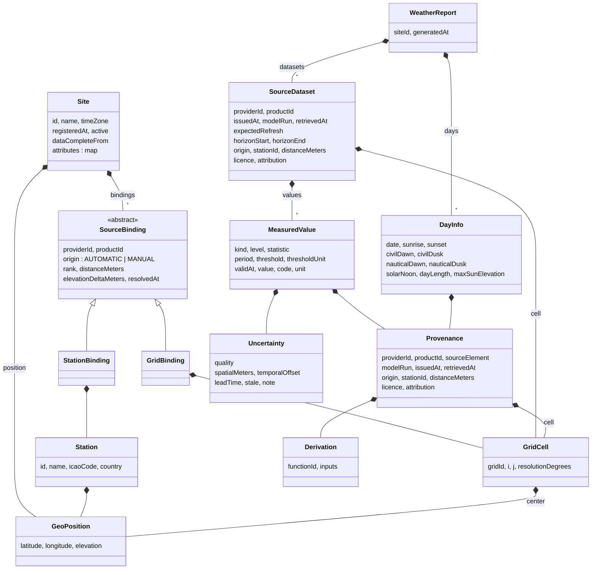

# The Model

Specification of `org.gecko.weather.model` — what the classes mean, which units values carry, and how
source elements map onto them. The Ecore (`model/weather.ecore`) is the single source of truth for
structure; this document carries the reasoning and the conventions the Ecore cannot express.

Written 2026-10-03 alongside the model. Where it disagrees with the Ecore, the Ecore wins and this
document is the thing to fix.

## Shape in one picture



Two roots, two files per site: the **`Site`** (registered once, changes rarely) and its
**`WeatherReport`** (rewritten whenever a source refreshes). `WeatherReport.siteId` is the join; there
is no cross-document EMF reference, so each file loads on its own.

## Principles the structure follows

1. **The site is the subject** ([ADR-0009](adr/0009-site-as-central-entity.md)). Everything is
   requested by site id. A site owns its bindings — which station, which grid cell per product — so
   that "where do I read for this place?" is answered once and persisted.
2. **Values are kept per source; nothing is merged** ([ADR-0013](adr/0013-values-per-source.md)). A
   report is a set of `SourceDataset`s, one per product. A consumer that wants cloud cover for 14:00
   finds a MOSMIX value (station, 8.9 km away) and an ICON-D2 value (cell, 640 m away) and decides.
3. **Every value stands on its own** ([ADR-0011](adr/0011-lineage-and-uncertainty.md)).
   `MeasuredValue` carries kind, qualifiers, unit, `Provenance` and `Uncertainty`. The provenance
   repeats what the dataset header says, deliberately: a value copied out of its dataset is still
   interpretable.
4. **Provider-neutral vocabulary** ([ADR-0005](adr/0005-provider-neutral-model.md)). No `MOSMIX`, no
   `TTT`, no `clct` in any type or feature name. Source names appear only as *data*:
   `productId = "MOSMIX_L"`, `sourceElement = "TTT"`.
5. **Few kinds, explicit qualifiers.** The old model had forty attributes that encoded source structure
   (`windGustProb25`, `precipitationLarger02Last6`). The new one has twenty `MeasurementKind`s and
   expresses the variants through `level`, `statistic`, `period` and `threshold`. Adding a source does
   not add kinds; adding a genuinely new quantity does.

## Classes

### Site and bindings

| Class | Meaning | Notes |
| --- | --- | --- |
| `Site` | A registered location of interest | `id` is assigned at registration and is the file name. `timeZone` (IANA) defines day boundaries for `DayInfo`; resolved from coordinates when not given. `attributes` is an open string map for consumer data — panel tilt and azimuth for a PV module, for example — so that no model change is needed for it (`INT-16`). |
| `GeoPosition` | WGS84 position | Degrees, north- and east-positive; `elevation` in metres above mean sea level, unsettable because catalogues do not always have it. |
| `SourceBinding` | Where a product is read for this site | Abstract. `origin` records whether the binding was resolved automatically (nearest) or assigned manually; **a manual binding overrides** (`M-4`). `rank 0` is primary; alternates (second-nearest station) have higher ranks. `distanceMeters` is great-circle distance to the station or cell centre. |
| `StationBinding` | A station product's binding | Contains a **snapshot** of the `Station`, so the site file stands alone even if the catalogue changes. |
| `GridBinding` | A gridded product's binding | Contains the `GridCell`. |
| `Station` | A catalogue entry | `id` is the provider's id (MOSMIX `10488`). |
| `StationCatalog` | A provider's station list as retrieved | Persisted so binding resolution works offline. |
| `GridCell` | One cell of a product grid | `gridId` names the grid definition (`icon-d2-regular-lat-lon`, `sis-de-v3`); `i` is the column (longitude), `j` the row (latitude). Indices mean nothing without the `gridId`. |

### Report and values

| Class | Meaning | Notes |
| --- | --- | --- |
| `WeatherReport` | Everything currently known for one site | One per site. `generatedAt` is the last write. |
| `SourceDataset` | What one product currently provides, from one issue | Replaced whole when the product publishes anew; the superseded one is archived by the repository. `expectedRefresh` is the product's cadence (MOSMIX_S `PT1H`, MOSMIX_L `PT6H`, ICON-D2 `PT3H`, SIS `PT15M`) so a consumer can judge staleness without product knowledge. `horizonStart`/`horizonEnd` bound the values. |
| `MeasuredValue` | One quantity, one instant, one source | See qualifiers below. `value` is unsettable: unset for coded kinds and for timesteps the source left empty (MOSMIX has gaps). `code` carries coded kinds. |
| `Provenance` | Where the value came from | `issuedAt` is mandatory: two values for the same `validAt` from the same product differ in issue time, and the newer is presumably better. `origin` distinguishes `STATION` (a weather service's network station), `GRID_CELL`, `COMPUTED`, `ADHOC` and `LOCAL_STATION` (a station the operator runs at the site — Bresser, Ecowitt; observations, pushed in). `licence`/`attribution` travel with the data (`QR-11`). |
| `Derivation` | How a `COMPUTED` value was produced | `functionId` names function and version (`solar.day-events/spa`); `inputs` are descriptors sufficient to recompute. |
| `Uncertainty` | How much to trust the value | `quality` is a coarse class; the facts sit beside it: `spatialMeters` (distance carried, or half a cell), `temporalOffset` (when interpolated in time), `leadTime` (`validAt − issuedAt`), `stale` (dataset older than `expectedRefresh`). No calibrated error bar is pretended. |
| `DayInfo` | Solar day events for one date at the site | Sunrise, sunset, civil and nautical twilight, solar noon, day length, maximum elevation. Computed from coordinates, no spatial error. Sun elevation and azimuth *per timestep* are not here — they are `MeasuredValue`s of kind `SUN_ELEVATION`/`SUN_AZIMUTH` in a `COMPUTED` dataset, so they align with the forecast values. |

### Qualifiers on `MeasuredValue`

| Qualifier | Values | Meaning |
| --- | --- | --- |
| `level` | `UNSPECIFIED`, `SURFACE`, `GROUND_5CM`, `GROUND_2M`, `GROUND_10M`, `MEAN_SEA_LEVEL`, `CLOUD_TOTAL`, `CLOUD_EFFECTIVE`, `CLOUD_LOW`, `CLOUD_MID`, `CLOUD_HIGH`, `CLOUD_BELOW_500FT` | Vertical reference. Cloud layers are levels of the one kind `CLOUD_COVER`. |
| `statistic` | `INSTANT`, `MEAN`, `MIN`, `MAX`, `ACCUMULATED`, `PROBABILITY` | How the value relates to `period`. `INSTANT` has no period. |
| `period` | ISO-8601 duration | The window **ending at `validAt`** for every statistic but `INSTANT`. |
| `threshold`, `thresholdUnit` | number + UCUM unit | For `PROBABILITY`: the probability (in `%`) that the quantity reaches `threshold` within `period`. The threshold keeps the *source's* unit (`25 [kn_i]`), because converting "25 knots" to `12.86 m/s` would destroy its meaning. |

So MOSMIX `FXh25` ("probability of gusts ≥ 25 kn in the last 12 h") is
`kind=WIND_GUST, level=GROUND_10M, statistic=PROBABILITY, period=PT12H, threshold=25, thresholdUnit=[kn_i], unit=%`.

## Canonical units

`unit` is always the canonical unit of the kind, in UCUM notation, carried on the value so that it is
self-describing. Providers convert at mapping time; consumers never see a source unit.

| Kind | Unit | Conventions |
| --- | --- | --- |
| `AIR_TEMPERATURE`, `DEW_POINT` | `Cel` | MOSMIX publishes Kelvin; mapping subtracts 273.15. |
| `RELATIVE_HUMIDITY` | `%` | |
| `SURFACE_PRESSURE` | `Pa` | Reduced pressure is `level=MEAN_SEA_LEVEL`, station pressure `level=SURFACE`. |
| `WIND_SPEED`, `WIND_GUST` | `m/s` | Gust probabilities: `statistic=PROBABILITY`, `unit=%`, threshold in source unit. |
| `WIND_DIRECTION` | `deg` | Meteorological: direction the wind comes *from*, 0 = north, clockwise. |
| `CLOUD_COVER` | `%` | Layer via `level`. |
| `GLOBAL_RADIATION`, `DIRECT_RADIATION`, `DIFFUSE_RADIATION` | `W/m2` | Published as hourly energy (MOSMIX `Rad1h`, kJ/m²) or as run-averaged power (ICON `aswdir_s`) — both become `statistic=MEAN, period=PT1H`. kJ/m² per hour ÷ 3.6 = W/m². ICON's run-average is de-averaged first ([09](09-source-inventory.md)). |
| `SUNSHINE_DURATION` | `s` | `ACCUMULATED` over `period`. |
| `PRECIPITATION`, `SNOW_WATER_EQUIVALENT` | `mm` | kg/m² ≡ mm. `ACCUMULATED` over `period`; probabilities with threshold in `mm`. |
| `FOG` | `%` | Only as `PROBABILITY`. |
| `VISIBILITY` | `m` | |
| `UV_INDEX` | `1` | Dimensionless. |
| `SIGNIFICANT_WEATHER` | `1` | Coded: `code` holds the WMO 4677 `ww` value, `value` is unset. |
| `SUN_ELEVATION`, `SUN_AZIMUTH` | `deg` | Elevation above the horizon; azimuth from north, clockwise. |

## Mapping examples

What a provider's mapper produces. The full MOSMIX and ICON tables live with the provider bundles once
they exist; these rows fix the conventions.

| Source element | Kind | Level | Statistic | Period | Threshold | Unit |
| --- | --- | --- | --- | --- | --- | --- |
| MOSMIX `TTT` | `AIR_TEMPERATURE` | `GROUND_2M` | `INSTANT` | — | — | `Cel` |
| MOSMIX `T5cm` | `AIR_TEMPERATURE` | `GROUND_5CM` | `INSTANT` | — | — | `Cel` |
| MOSMIX `TN` / `TX` | `AIR_TEMPERATURE` | `GROUND_2M` | `MIN` / `MAX` | `PT12H` | — | `Cel` |
| MOSMIX `Td` | `DEW_POINT` | `GROUND_2M` | `INSTANT` | — | — | `Cel` |
| MOSMIX `FF` / `DD` | `WIND_SPEED` / `WIND_DIRECTION` | `GROUND_10M` | `INSTANT` | — | — | `m/s` / `deg` |
| MOSMIX `FX1` / `FX3` / `FXh` | `WIND_GUST` | `GROUND_10M` | `MAX` | `PT1H` / `PT3H` / `PT12H` | — | `m/s` |
| MOSMIX `FXh25` / `FXh40` / `FXh55` | `WIND_GUST` | `GROUND_10M` | `PROBABILITY` | `PT12H` | 25 / 40 / 55 `[kn_i]` | `%` |
| MOSMIX `N` / `Neff` / `Nl` / `Nm` / `Nh` / `N05` | `CLOUD_COVER` | `CLOUD_TOTAL` / `CLOUD_EFFECTIVE` / `CLOUD_LOW` / `CLOUD_MID` / `CLOUD_HIGH` / `CLOUD_BELOW_500FT` | `INSTANT` | — | — | `%` |
| MOSMIX `Rad1h` | `GLOBAL_RADIATION` | `SURFACE` | `MEAN` | `PT1H` | — | `W/m2` |
| MOSMIX `PPPP` | `SURFACE_PRESSURE` | `MEAN_SEA_LEVEL` | `INSTANT` | — | — | `Pa` |
| MOSMIX `RR1c` / `RR3c` | `PRECIPITATION` | `SURFACE` | `ACCUMULATED` | `PT1H` / `PT3H` | — | `mm` |
| MOSMIX `R602` / `R650` / `Rh00` … | `PRECIPITATION` | `SURFACE` | `PROBABILITY` | `PT6H` / `PT12H` / `P1D` | 0.2 / 5 / 0 `mm` | `%` |
| MOSMIX `RRS1c` / `RRS3c` | `SNOW_WATER_EQUIVALENT` | `SURFACE` | `ACCUMULATED` | `PT1H` / `PT3H` | — | `mm` |
| MOSMIX `SunD1` | `SUNSHINE_DURATION` | `SURFACE` | `ACCUMULATED` | `PT1H` | — | `s` |
| MOSMIX `VV` | `VISIBILITY` | `SURFACE` | `INSTANT` | — | — | `m` |
| MOSMIX `ww` | `SIGNIFICANT_WEATHER` | `UNSPECIFIED` | `INSTANT` | — | — | `1` (code) |
| MOSMIX `wwM` / `wwM6` / `wwMh` | `FOG` | `SURFACE` | `PROBABILITY` | `PT1H` / `PT6H` / `PT12H` | — | `%` |
| ICON-D2 `clct` / `clcl` / `clcm` / `clch` | `CLOUD_COVER` | `CLOUD_TOTAL` / `CLOUD_LOW` / `CLOUD_MID` / `CLOUD_HIGH` | `INSTANT` | — | — | `%` |
| ICON-D2 `aswdir_s` / `aswdifd_s` | `DIRECT_RADIATION` / `DIFFUSE_RADIATION` | `SURFACE` | `MEAN` | `PT1H` | — | `W/m2` |
| SIS `SIS` | `GLOBAL_RADIATION` | `SURFACE` | `MEAN` | `PT15M` / `PT1H` | — | `W/m2` |
| UV `uvi` | `UV_INDEX` | `SURFACE` | `MAX` | `P1D` | — | `1` |
| computed | `SUN_ELEVATION` / `SUN_AZIMUTH` | `UNSPECIFIED` | `INSTANT` | — | — | `deg` |

`W1W2` (significant weather over two 3-hour intervals) is not mapped in the first version; `ww` covers
the current interval.

## Time and dates

`Instant`, `Duration` and `LocalDate` are custom `EDataType`s on `java.time` (`DEV-10`). EMF cannot
serialise them unaided, so the package declares `conversionDelegates="java.time"` and the bundle ships
the delegate factory, published to the Fennec conversion-delegate whiteboard in OSGi and registered by a
static call outside it. Serialisation is ISO-8601 throughout: `2026-10-03T14:00:00Z`, `PT12H`,
`2026-10-03`. See the bundle [README](../org.gecko.weather.model/README.md) for the mechanics and the
one trap (EMF caches a missing delegate).

All instants are UTC. The only local notion is `DayInfo.date`, which is a calendar day in
`Site.timeZone`.

## Persistence layout

The repository is a configurable local folder of XMI files ([ADR-0004](adr/0004-persistence-index-split.md)
with the backend question answered for the MVP; the `WeatherRepository` boundary keeps the Fennec
persistence layer or a Lucene index as later options):

```
<root>/                                   configurable, default data/weather
  sites/<siteId>.xmi                      Site
  reports/<siteId>.xmi                    WeatherReport — current dataset per product
  archive/<siteId>/<providerId>/<productId>/<yyyyMMddTHHmmssZ>.xmi
                                          superseded SourceDataset, append-only
  catalogs/<providerId>/<productId>.xmi   StationCatalog
  state/<providerId>/<productId>.xmi      SourceStateRecord — ingest validators per URL
```

Identifiers are percent-encoded into file names; the issue stamp is UTC without colons so it sorts as
text. One file per site means one writer per site: no locking across sites, and a write is
proportional to one report. The archive is the history; the report is the present. Implementation:
[`org.gecko.weather.repository.file`](../org.gecko.weather.repository.file/README.md).

## Own weather stations are a source like any other

A station the operator runs at the site — Bresser, Ecowitt and the like — needs nothing new in the
model: it is a provider (`providerId=ecowitt`, `productId` the device family), bound to the site
manually like any station, delivering a `SourceDataset` whose values carry `Quality.OBSERVED` and
`Origin.LOCAL_STATION`. The difference is in *how* data arrives: pushed by the device's gateway every
minute instead of fetched every few hours. The API carries that as `WeatherDataSink` — `replace` for
issues, `append` for streams — and the DWD fetch path goes through the same sink, so report assembly
and archive are one mechanism. Consumers then see, side by side for 14:00, what the own station
measured, what the MOSMIX station forecast and what the ICON-D2 cell forecast.

## What is deliberately not in the model

- **No merged or "best" value** — [ADR-0013](adr/0013-values-per-source.md).
- **No operations.** Reading helpers (timeline per kind, values at an instant) are API code, not
  EOperations, so the model stays a pure data contract and generated code stays untouched.
- **No WMO weather-code enumeration.** The old model carried 146 literals; a coded `int` plus the
  WMO 4677 table reference is enough, and the table is the consumer's to interpret.
- **No value identity.** Values are addressed by `(dataset, kind, qualifiers, validAt)`; `Derivation.inputs`
  uses descriptors, not references. Revisit if cross-value references are ever needed.

## Open points

- Whether `Uncertainty.quality` should become a set of flags; a value can be `FORECAST` and
  `INTERPOLATED` at once. One enumeration is kept until interpolation exists.
- `thresholdUnit` keeps the source unit by design; whether consumers want a canonical copy beside it.
- Whether `Site` should carry a `horizon` preference, or whether the horizon is always whatever the
  sources give (currently the latter).
