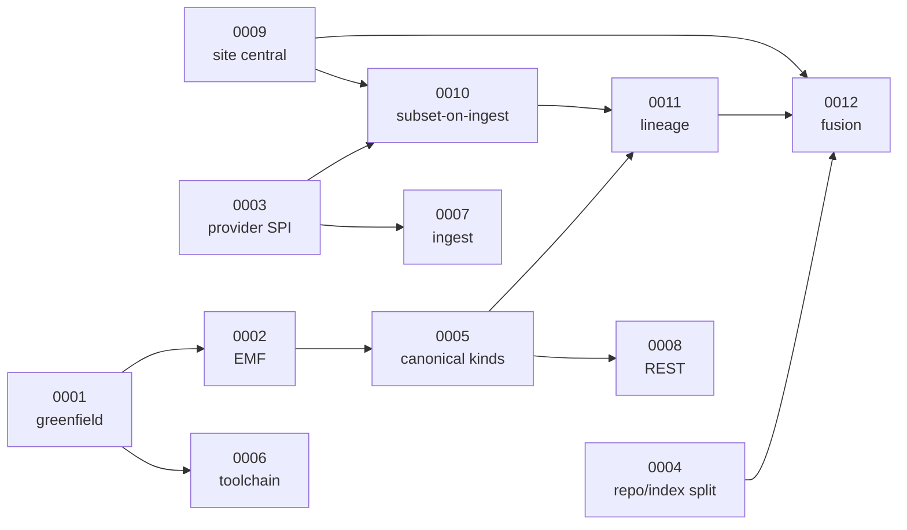

# Architecture Decision Records

One file per decision. Copy [0000-template.md](0000-template.md) to start a new one.

## Rules

- Numbering is sequential and never reused.
- **`Proposed` means editable.** An ADR is a proposal until the deciders have signed it off, and a
  proposal is revised in place — including its decision. Nothing is binding because it is written
  down; it becomes binding when someone decides it. The `Deciders` line reads `sign-off pending`
  until then.
- **From `Accepted` onward an ADR is immutable.** Changing an accepted decision means a new ADR with
  `Supersedes: ADR-XXXX`, and editing the old one's status line to `Superseded by ADR-YYYY` — that
  status line is then the only permitted edit.
- Every ADR names its costs. An ADR whose consequences are all positive has not been thought through.
- Reference as-is findings by ID (`F-n`, see [../04-architecture-current.md](../04-architecture-current.md))
  and requirements by ID (`DEV-n`, `INT-n`, `OPS-n`, `QR-n`, see
  [../03-requirements.md](../03-requirements.md)) instead of restating the analysis.

## Index

| ADR | Decision | Status | Key cost accepted |
| --- | --- | --- | --- |
| [0001](0001-greenfield-new-repository.md) | Rebuild greenfield on a new branch | Proposed | Old code one checkout away; no incremental safety net; branch-level release config |
| [0002](0002-emf-as-core-model.md) | EMF/Ecore as core model, on the **Eclipse Fennec** stack | Proposed | Ecore edits need tooling; the Lucene integration is now ours; most of Fennec is pre-1.0 |
| [0003](0003-provider-spi.md) | Provider SPI with transport separated from decoding, streaming sink | Proposed | More interfaces than a monolithic fetcher; two very different decoder effort classes behind one interface |
| [0004](0004-persistence-index-split.md) | Durable repository, separate rebuildable Lucene index | Proposed | Data written twice; rebuild path must be tested; **backend still open** |
| [0005](0005-provider-neutral-model.md) | Provider-neutral model with canonical measurement kinds | Proposed | Vocabulary must be curated; adding a quantity is a core release; **declarative mechanism still open** |
| [0006](0006-java-baseline-toolchain.md) | Java 21, bnd 7.4, OSGi R8 | Proposed | Diverges from Java 17 / bnd 7.0.0; runs a bnd **snapshot** until 7.4.0 ships |
| [0007](0007-ingest-and-scheduling.md) | Ingest runtime with conditional GET, retry, per-provider isolation | Accepted | Ingest becomes a component with its own state, not a cron method |
| [0008](0008-rest-api-design.md) | Versioned, OpenAPI-first REST API with RFC 9457 errors | Proposed | Version segment must be honoured; no compatibility layer; timestep grouping stays hand-written |
| [0009](0009-site-as-central-entity.md) | The site is the central entity, not the station | Accepted | Sites are state that must be stored, resolved and maintained |
| [0010](0010-subset-on-ingest.md) | Subset-on-ingest for gridded products | Accepted | **Irreversible**: a site added later has no history |
| [0011](0011-lineage-and-uncertainty.md) | Lineage and uncertainty as first-class model concepts | Accepted | Every value is heavier; responses are more verbose |
| [0012](0012-fusion-and-supersession.md) | Configurable fusion, supersession instead of overwrite | Accepted | Storage grows with every revision; fusion computed per request |

## Decision dependencies

`0009` and `0011` are the load-bearing ones: everything about accuracy follows from the site being the
subject, and everything about trust follows from values carrying their origin. Both are also the
hardest to retrofit, which is why they are decided first and implemented in the MVP.

## Revision 2026-07-29 — Eclipse Fennec

The technology stack changed after the kickoff: many Gecko projects have been donated to the Eclipse
Foundation and continue as **Eclipse Fennec**. `0001`, `0002`, `0004`, `0005` and `0006` were revised to
record what was actually decided and set up; they are back to `Proposed` because none of these have
been signed off.

**On versions.** `emf.osgi` has releases up to 1.0.2, but the workspace runs **1.1.0-SNAPSHOT**,
because 1.1 is where the metadata mechanism lives (`0005`) and it replaces the separate
`fennecEMFMetadata` library outright. The other Fennec libraries still pin `emf.osgi` 0.1.2 in their own
indexes, so several versions sit in the repository pool; upstream is aligning that in the next snapshot
round. Whether that ever becomes `F-13` depends on the resolve, which cannot be tested before the first
bundle and bndrun exist — tracked as a risk in `0002`, not asserted as a defect.

The remaining open item for `0005` is therefore not availability but `DEV-5`, which names Ecore
annotations as the mechanism.

All seven stack-affected ADRs are now revised: `0001`–`0006` and `0008`. `0007`, `0009`–`0012` are
untouched by the stack change and still read as written at the kickoff.

Still unrevised and still naming Gecko bundles throughout: `05-architecture-target.md` and
`07-migration.md`. `06-redesign-plan.md` also predates all of this — its increment 0.1 says "new
repository", 0.6 carries the naming question that `0001` has since closed, and 1.3 treats a file-based
repository as settled where `0004` reopened it.
